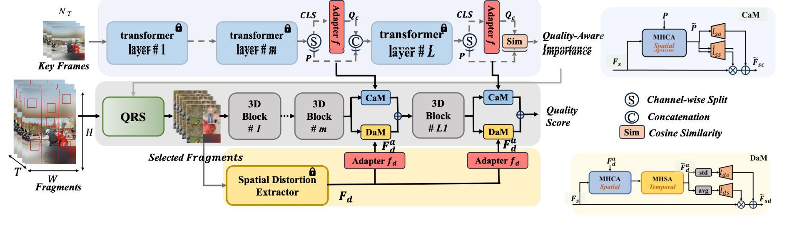
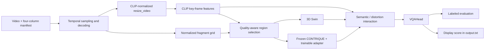
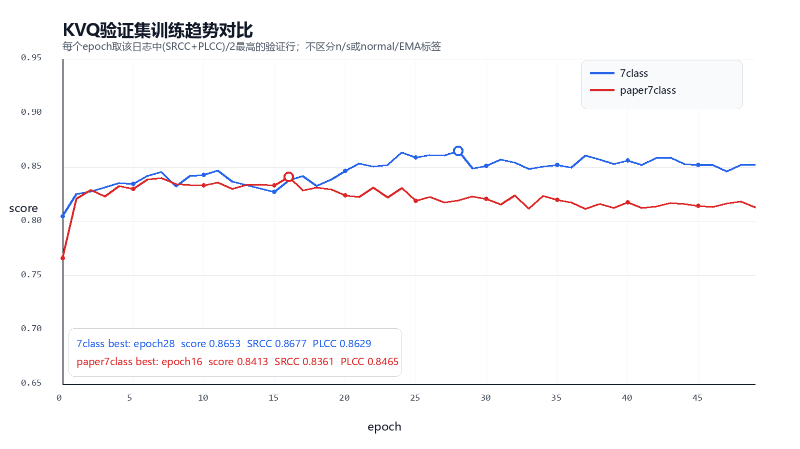

# KSVQE 无参考视频质量评价

[English Version](README_EN.md)

本项目围绕无参考视频质量评价任务，对 KSVQE 进行复现、适配与跨域评测。我跑通并整理了 KSVQE 的训练和评价流程，比较不同训练设置在 KVQ 与其他视频数据集上的表现，并结合保留的 BRISQUE 结果，检查两种方法对人工失真的响应是否一致。

我基于 [CVPR 2024 KVQ / KSVQE 官方代码](https://github.com/lixinustc/KVQ-Challenge-CVPR-NTIRE2024) 进行复现和适配，包括数据与配置适配、权重加载调试、训练测试和结果整理。KSVQE 网络来自原论文与开源实现，并非我提出的原创方法。我还参与了包含 BRISQUE、人工失真控制和网页展示的团队演示；当前仓库保留了相关结果记录，但没有这些部分的实现源码，因此不能直接从这里启动完整 Web 系统。

## 方法与调用流程

主要调用链是：

```text
train.py / test.py
  → trainer.py::Trainer
  → datasets.ViewDecompositionDataset_KVQ
  → models.model.VQA_Network
  → models.backbones.KSVQE_model.KSVQE
  → models.head.VQAHead
```



上图来自原论文，用于理解方法；当前实现以 [KSVQE_model.py](models/backbones/KSVQE_model.py) 为准。

KSVQE 结合 CLIP ViT-B/16 语义特征、质量相关区域选择（QRS）、冻结的 CONTRIQUE 失真编码器和 3D Swin 时空特征，再通过语义与失真适配、注意力交互和调制融合特征，交给 VQAHead 回归质量分数。我在这里使用和调试这条流程，没有把这些研究模块作为个人原创方法。



这里有一个容易被示意图简化的代码细节：dataset 会返回 `ori_fragment`，但当前 KSVQE 前向过程实际把 QRS 选出的 `x_sel_ori.detach()[:, :, ::2, ...]` 送入 CONTRIQUE，并不是直接读取 `ori_fragment`。

## 视频与标注处理

标注文件每行四列，不带表头：

```text
relative/video.mp4,cls_label,dis_label,mos
```

路径相对于 YAML 的 `data_prefix`；`mos` 是训练和验证用的主观质量分数，`dis_label` 进入失真对比损失。dataset 会解析 `cls_label`，但当前 KSVQE 前向读取的是 `dis_label`。

[datasets/fusion_datasets.py](datasets/fusion_datasets.py) 中的流程包括：

1. 用 `UnifiedFrameSampler` 选取帧索引。主配置 `clip_len=32`，训练 `num_clips=1`，验证 `num_clips=3`；challenge 设置的间隔为 4，paper-like 设置为 2。
2. 优先通过 Decord 解码请求帧的并集，避免重复解码。异常时进入 OpenCV 回退分支；回退分支没有显式 BGR→RGB 转换，不能假定两条路径数值完全一致。
3. 生成 resize view，并按 CLIP 的均值、标准差归一化。
4. 抽取 9 × 9 个 32 × 32 的空间 fragments，拼成 288 × 288，再按 ImageNet 风格的像素统计量归一化。
5. 返回 `resize_video`、`fragment`、`ori_fragment`、帧索引、原始尺寸和标签。

进入网络的 fragment 张量为 $B\times3\times T\times288\times288$，$B$ 为 batch size，$T$ 为采样后的总帧数。当前无 `t_frag` 的主配置在训练时取 32 帧，验证配置取 96 帧。`num_clips=3` 是采样配置；KSVQE 直接读取 `fragment` / `resize_video`，通用 Trainer 按模型键拆分 clip 的逻辑没有直接作用到这两个键，因此这里不把它描述为已经核实的“三次独立推理再平均”。

### 两种训练划分与七类标签

| 设置 | challenge / 7class | reference 80/20 / paper7class |
| --- | --- | --- |
| 划分方式 | 原 challenge 目录划分 | 合并原 Train / Validation / Test 标注后，按连续七行组成的组重新划分 |
| train batch size | 4 | 8 |
| frame interval | 4 | 2 |
| 主配置 | [Kwai_KSVQE.yml](config/Kwai_KSVQE.yml) | [Kwai_KSVQE_paper7class.yml](config/Kwai_KSVQE_paper7class.yml) |

[make_kvq_paper_split.py](scripts/make_kvq_paper_split.py) 假定每连续七行属于同一 reference content，用 seed 42 打乱这些组，按 80/20 划分，并按组内位置把两列标签都写成 0–6。源标注的顺序必须满足这个假定；它不读取真实 reference ID 或编码 QP 元数据。

旧实验汇总把七类称为“原始视频 + 6 个 QP bin”，但当前脚本只能确认**按行位置生成的近似标签**，不能证明每个编号对应真实 QP 档位。`paper7class` 表示当时尝试的 paper-like 设置，不等于精确复现论文协议，也不是保留原官方测试集不变的划分。

另一个 [labeltotxt.py](labeltotxt.py) 则每七行赋同一个递增组 ID，行为与组内 0–6 编号不同，不能把它直接当作等价的七类标签生成器。

## 训练与评价

两份主配置均使用 50 epochs、2.5 epochs warmup、AdamW、学习率 `3e-5`、weight decay 0.05，启用 EMA，参数更新系数为 0.999。回归头配置为输入通道 768、隐藏通道 64。

当前主训练目标是：

$$
L=L_{\mathrm{PLCC}}+0.3\,L_{\mathrm{distortion\_contrastive}}.
$$

`trainer.py` 还计算可配置的 rank loss，两份主配置中的权重都是 0。PLCC loss 使用 batch 标准化后的预测、MOS 及相关项计算；具体实现见 [trainer.py](trainer.py)，不要把它简单理解为原始分数上的 MSE。

权重加载支持普通参数字典或顶层 `state_dict`，会移除 `module.` 前缀，将旧 `technical_backbone` / `technical_head` 前缀映射为当前 KSVQE 名称，并打印 missing / unexpected keys。辅助预训练权重支持 `KSVQE_SWIN_WEIGHTS`、`KSVQE_CONTRIQUE_WEIGHTS` 和 `KSVQE_CLIP_WEIGHTS` 环境变量覆盖路径。

### 有标签评价与展示分数

`test.py --mode val` 使用有效 MOS，汇总每个视频的预测后，将预测均值和标准差线性对齐到这批 MOS：

$$
\widetilde{p}_i=\frac{p_i-\mu_p}{\sigma_p}\,\sigma_y+\mu_y.
$$

随后计算 SRCC（也称 SROCC）、PLCC、KRCC 和 RMSE。这里的对齐使用评价集标签，不是独立训练出来的校准模型；不同数据集 MOS 标度不同，不宜直接横向比较 RMSE。

`test.py --mode test` 不做上述标签对齐，而是裁剪并映射展示分数：

$$
q=1+4\,\frac{\operatorname{clip}\!\left(p,-2.5,2.5\right)+2.5}{5}.
$$

输出写入根目录 `output.txt`，范围为 $[1,5]$。这是代码中的展示用启发式映射；它不等于下面团队演示表的分数标度，也不能替代带标签的评价。

## 保存的实验结果

以下数值来自 [ksvqe_benchmarks.csv](docs/results/ksvqe_benchmarks.csv)。[结果来源说明](docs/results/README.md) 将多数行标为整理时曾核对原始日志，但原始日志没有随当前仓库提交；这里保留来源标记，不把本次文档核对写成重新跑出的实验。

| 训练设置 | 数据集 | SRCC | PLCC | KRCC | RMSE |
| --- | --- | ---: | ---: | ---: | ---: |
| challenge / 7class | KVQ | 0.8657 | 0.8679 | 0.6793 | 0.3063 |
| challenge / 7class | LIVE-VQC | 0.5010 | 0.5372 | 0.3509 | 16.4111 |
| challenge / 7class | KoNViD-1k | 0.4667 | 0.4789 | — | — |
| challenge / 7class | YouTube-UGC | 0.6383 | 0.6357 | 0.4525 | 0.5524 |
| reference 80/20 / paper7class | KVQ | 0.8372 | 0.8456 | 0.6471 | 0.3170 |
| reference 80/20 / paper7class | LIVE-VQC | 0.5859 | 0.5988 | 0.4117 | 15.2799 |
| reference 80/20 / paper7class | KoNViD-1k | 0.5432 | 0.5601 | 0.3822 | 0.6011 |
| reference 80/20 / paper7class | YouTube-UGC | 0.7038 | 0.7110 | 0.5099 | 0.4920 |

challenge / KoNViD-1k 行被明确标为汇总报告来源，旧来源说明记载原日志只到 16/1200。尽管旧指标汇总另列了 KRCC、RMSE，这里按来源更明确的 CSV 留空，不补成已确认结果。

从这些记录来看，我调整后的 paper7class 在 KVQ 上的 SRCC 从 0.8657 降到 0.8372，在 LIVE-VQC、KoNViD-1k、YouTube-UGC 上分别从 0.5010 / 0.4667 / 0.6383 变为 0.5859 / 0.5432 / 0.7038。划分、batch size 和时间间隔一起改变了，所以我把它理解为两套设置的观察结果，没有据此认定某一项修改单独改善了跨库表现。



图中是归档的验证趋势，不是这次重新训练的结果。还要注意，Trainer 保存的历史 best tuple 对各指标分别取最大或最小值，不保证来自同一个 epoch；核对 checkpoint 时应看具体评测输出，而不只看 `model-n` / `model-s` 或汇总 best 值。

## BRISQUE、人工失真与网页演示记录

在我参与的团队演示中，KSVQE 用于深度视频质量评分，BRISQUE 作为传统无参考图像质量方法对比。已有说明记录了逐帧 BRISQUE 处理及 RBF-SVR 拟合视频 MOS，也记录了视频上传、压缩、blur、sharpen、noise、fog、brightness / saturation 控制和并列评分展示。

**这些功能的 Web 前后端、失真生成代码、BRISQUE 实现和原始日志没有提交。** 当前可以检查的是 [推理交接说明](handoff_fullstack_inference/HANDOFF_README.md)、KSVQE 推理入口和结果 CSV；不能从仓库确认 Web 路由、失真参数单位、分数转换公式或具体个人分工。

### 单视频失真示例

[team_distortion_demo.csv](docs/results/team_distortion_demo.csv) 保存了同一演示视频的以下结果。level 是演示中的参数值，单位未保存；两列都是演示页面使用的“越大越好”分数。来源说明记载 BRISQUE 原始“越小越好”的失真分数在展示前做过反向处理。

| 条件 | level | KSVQE 展示分数 | 相对 clean | BRISQUE 展示分数 | 相对 clean |
| --- | ---: | ---: | ---: | ---: | ---: |
| clean | 0 | 45.7 | 0.0 | 47.6 | 0.0 |
| compression | 10 | 36.9 | -8.8 | 44.1 | -3.5 |
| blur | 12 | 47.9 | +2.2 | 41.2 | -6.4 |
| sharpen | 10 | 45.1 | -0.6 | 45.0 | -2.6 |
| fog | 50 | 46.1 | +0.4 | 43.5 | -4.1 |
| fog | 100 | 52.7 | +7.0 | 30.5 | -17.1 |
| noise | 30 | 41.1 | -4.6 | 42.3 | -5.3 |

这里有一个和直觉不完全一致的现象：blur 和 fog 条件下，KSVQE 展示分数反而上升，BRISQUE 展示分数下降；fog 从 50 到 100 时，这个差别更明显。compression 和 noise 则让两个展示分数都下降。

我目前把它保留为一个需要继续检查的现象。区域选择对内容变化的响应、训练失真分布和展示标度都有可能影响结果，但缺少失真实现与多视频对照，不能确定原因，更不能总结成“加雾改善质量”或“某个模型普遍更好”。已有记录没有 brightness 的准确数值，也没有完整的强度扫描曲线，这里没有补齐。

### BRISQUE + SVR 记录

[brisque_svr_reported.csv](docs/results/brisque_svr_reported.csv) 记录的是团队材料中的 LIVE-VQC 117 视频验证划分：

| 设置 | SRCC | PLCC |
| --- | ---: | ---: |
| 默认采样 + 默认 SVR | 0.5141 | 0.5529 |
| 均匀 32 帧 + 默认 SVR | 0.5108 | 0.5476 |
| 均匀 32 帧 + GridSearchCV | 0.5110 | 0.4848 |

这组记录里，增加均匀采样或网格搜索并没有带来一致改善，最后一组 PLCC 反而更低。我没有把它与不同划分的 KSVQE 跨库结果当作严格同协议排名。

## 如何运行 KSVQE

从仓库根目录执行。优先复用已有环境；[requirements.txt](requirements.txt) 记载的历史环境是 Python 3.8 / CUDA 11.8 / RTX 4090，这不表示只支持这一张显卡。当前 Trainer 显式使用 CUDA，没有可直接切换的 CPU 推理路径。

```powershell
python -m pip install -r requirements.txt
python -c "import torch, cv2, decord, timm, einops; print(torch.__version__, torch.cuda.is_available())"
```

PyTorch 需要与本机 CUDA 环境匹配。依赖文件使用范围约束，并非当时环境的完整锁定版本。

### 数据和权重

本地目录示例：

```text
data/
├── KVQ-dataset/
│   ├── Train/
│   ├── Validation/
│   └── Test/
├── LIVE-VQC/videos/
├── KoNViD-1k/videos/
└── YouTube-UGC/original_videos_h264/
```

原始视频、实际标注清单和 `dataset_csv/` 不在 Git 中。数据来源包括 [KVQ](https://lixinustc.github.io/projects/KVQ/)、[LIVE-VQC](https://live.ece.utexas.edu/research/LIVEVQC/)、[KoNViD-1k](https://database.mmsp-kn.de/konvid-1k-database.html) 和 [YouTube-UGC](https://media.withyoutube.com/)。四列格式示例见 [manifest.example.txt](examples/manifest.example.txt)。

辅助权重需要 CLIP ViT-B/16、CONTRIQUE 和 3D Swin；训练配置还使用 LSVQ 预训练 KSVQE 权重。清单见 [pretrained_weights/README.md](pretrained_weights/README.md)。已有 Git LFS 时按需获取：

```powershell
git lfs pull --include="pretrained_weights/clip/ViT-B-16.pt,pretrained_weights/CONTRIQUE_checkpoint25.tar,pretrained_weights/swin_tiny_patch244_window877_kinetics400_1k.pth,pretrained_weights/KSVQE_techniqual_pretrainonLSVQ.pth,handoff_fullstack_inference/final_weights/KSVQE_paper7class_head_val-ltest_s_finetuned.pth"
python check_ksvqe_swin_load.py --mode inspect
```

仓库中的权重条目是 LFS 指针，运行前需要实际对象，而非只有指针文本。

### 划分与训练

先准备源四列标注：`Train/train_data_4col_7class.txt`、`Validation/val_truth_4col_7class.txt`、`Test/test_MOS_7class.txt`。仅有视频目录还不能运行划分脚本。确认每七行确为同一参考内容后，在新的输出目录生成 paper-like 划分：

```powershell
python scripts/make_kvq_paper_split.py --dataset-root data/KVQ-dataset --out-dir dataset_csv/KVQ_paper_split_reproduce --seed 42 --train-ratio 0.8
```

复制相应训练 YAML，在副本中设置实际的 `anno_file`、`data_prefix`、`load_path`；paper-like 副本应指向刚生成的两个划分文件。以下假定副本命名为 `config/local_challenge.yml` 和 `config/local_paper7class.yml`，需要先自行创建：

```powershell
python train.py --opt config/local_challenge.yml --gpu_id 0 -r checkpoint_challenge_reproduce/
python train.py --opt config/local_paper7class.yml --gpu_id 0 -r checkpoint_paper7class_reproduce/
```

多卡入口为 `train_ddp.py`，启动参数可参考 [train_KSVQE_ddp.sh](scripts/train_KSVQE_ddp.sh)。

### 有标签评价

先复制 [测试配置](config/Kwai_KSVQE_test.yml)，核对视频、MOS、采样间隔和 checkpoint。该文件当前组合是 **KVQ Test 标注、interval 4、paper7class 权重**，不应把默认命令等同于表中任何一套历史协议。尤其要同时核对 `test_load_path`：`test.py` 会用它覆盖 `load_path`。

```powershell
python test.py --opt config/local_eval.yml --gpu_id 0 --mode val
```

跨库配置可参考 [LIVE-VQC](config/Kwai_KSVQE_livevqc.yml)、[KoNViD-1k](config/Kwai_KSVQE_konvid.yml) 和 [YouTube-UGC](config/eval_youtube_paper7class.yml)，仍需检查实际 checkpoint 与协议。

### 无标签评分

四列格式仍然需要保留，例如：

```text
uploads/example.mp4,0,0,0
```

复制测试 YAML 为 `config/local_inference.yml`，设置 `anno_file`、`data_prefix` 和 `test_load_path` 后执行：

```powershell
python test.py --opt config/local_inference.yml --gpu_id 0 --mode test
```

结果写入 `output.txt`，格式为 `video_name,score`；重复运行会覆盖这个文件，需要保留时先另存结果。这是当前仓库的推理接口，没有配套可启动的 Web 服务。

### 已有失真组分析

[analyze_kvq_distortions.py](scripts/analyze_kvq_distortions.py) 分析现有 KVQ 七视频组的元数据和可选帧统计，再做标准化、PCA、K-means 等探索。它不生成 blur / fog / noise 视频。加入帧统计时：

```powershell
python scripts/analyze_kvq_distortions.py --train-root data/KVQ-dataset/Train --val-root data/KVQ-dataset/Validation --test-root data/KVQ-dataset/Test --with-frame-features --out-dir analysis/kvq_reproduce
```

需要对应标注；元数据读取还会调用 `ffprobe`。帧统计包含亮度、对比度、锐度等，仅供探索，不等于真实 processing-pattern 标签。

## 仓库目录

```text
.
├── config/                    # 训练、评价和跨库配置
├── datasets/                  # 解码、采样与多视图处理
├── models/                    # KSVQE、CLIP、CONTRIQUE、Swin 与回归头
├── docs/results/              # 指标 CSV 及来源说明
├── figs/                      # 论文框架和归档实验图片
├── pretrained_weights/        # 辅助预训练权重的 LFS 指针
├── handoff_fullstack_inference/ # 推理交接说明和最终权重指针
├── scripts/                   # 划分、检查、分析和启动脚本
├── train.py / train_ddp.py
├── test.py / trainer.py
├── KSVQE_RUNBOOK.md            # 既有运行手册
├── KSVQE实验指标汇总.md         # 历史汇总，部分描述需结合代码核对
├── PROJECT_SUMMARY.md          # 既有项目整理
├── requirements.txt
├── README.md
└── README_EN.md
```

我保留了实验中的不一致和实现限制，便于以后继续核查。当前没有重新训练、重新计算完整测试集指标，也没有用缺失的 Web / BRISQUE 代码推导新结论。

## 来源与引用

KSVQE / KVQ 的研究与核心实现归原作者；仓库还使用了 CLIP、CONTRIQUE、Swin，以及上游引用的 SimpleVQA、DOVER 组件。权重和代码使用应遵循各自来源的许可；当前仓库不能提供完整的第三方授权结论。

```bibtex
@inproceedings{lu2024kvq,
  title={KVQ: Kwai Video Quality Assessment for Short-form Videos},
  author={Lu, Yiting and Li, Xin and Pei, Yajing and Yuan, Kun and Xie, Qizhi and Qu, Yunpeng and Sun, Ming and Zhou, Chao and Chen, Zhibo},
  booktitle={Proceedings of the IEEE/CVF Conference on Computer Vision and Pattern Recognition},
  year={2024}
}

@inproceedings{li2024ntire,
  title={NTIRE 2024 Challenge on Short-form UGC Video Quality Assessment: Methods and Results},
  author={Li, Xin and Yuan, Kun and Pei, Yajing and Lu, Yiting and Sun, Ming and Zhou, Chao and Chen, Zhibo and Timofte, Radu and others},
  booktitle={Proceedings of the IEEE/CVF Conference on Computer Vision and Pattern Recognition Workshops},
  year={2024}
}
```

Upstream acknowledgments: [KVQ/KSVQE](https://github.com/lixinustc/KVQ-Challenge-CVPR-NTIRE2024), [SimpleVQA](https://github.com/sunwei925/SimpleVQA) and [DOVER](https://github.com/VQAssessment/DOVER).
