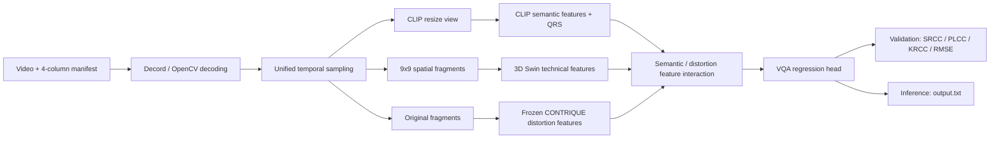

# KSVQE Video Quality Assessment

> Reproduction, evaluation and deployment-oriented engineering for no-reference short-form video quality assessment, with archived KSVQE–BRISQUE comparison evidence from a team demo.

## Overview

This repository turns the official [KVQ / KSVQE challenge code](https://github.com/lixinustc/KVQ-Challenge-CVPR-NTIRE2024) into a traceable video-quality pipeline: dataset manifest construction, temporal sampling, spatial fragment extraction, KSVQE fine-tuning, validation, cross-dataset evaluation and inference output.

本项目的个人工作重点是 **KSVQE 论文与代码复现、数据与配置适配、训练/测试流程跑通、权重加载调试、跨库实验和结果分析**。团队原型还集成过 BRISQUE、人工失真控制和网页展示；这些部分只有演示材料与结果留存在当前工作区，源码并未随本仓库保存，因此下文会明确标记为 team-demo evidence，不把它描述为可由本仓库直接复现的个人实现。


## Features

- End-to-end KSVQE train / validation / inference entry points based on PyTorch.
- Decord-first video decoding with an OpenCV fallback.
- Multi-view preprocessing: CLIP resize view, normalized spatial fragments and original fragments.
- Reference-content 80/20 split builder with fixed seed for the paper-like 7-class experiment.
- SRCC, PLCC, KRCC and RMSE evaluation plus cross-dataset tests on LIVE-VQC, KoNViD-1k and YouTube-UGC.
- Explicit model-checkpoint key normalization and EMA evaluation.
- Heuristic KVQ processing-workflow analysis using metadata and sampled-frame statistics.
- Curated result provenance: raw-log-backed values are separated from presentation-only values.

## Pipeline



The implementation path is `train.py` or `test.py` → `Trainer` → `ViewDecompositionDataset_KVQ` → `VQA_Network` → `KSVQE` → `VQAHead`.

## Method

### Video preprocessing

Each annotation row is:

```text
relative/video.mp4,content_or_class_label,distortion_label,mos
```

The main dataset class performs the following work:

1. `UnifiedFrameSampler` selects clips from the full frame range. Main experiments use 32 frames per clip; the paper-like setting uses interval 2, while the original challenge-style setting uses interval 4. Training uses one clip and validation uses three clips.
2. `decord.VideoReader` decodes the union of requested frame indices once. If that path fails, the code falls back to OpenCV decoding.
3. A resized view is normalized with CLIP statistics for semantic feature extraction.
4. A technical view is built from a 9 × 9 grid of 32 × 32 fragments, yielding a 288 × 288 fragment tensor, and normalized with ImageNet-style pixel statistics.
5. The original sampled fragment tensor, frame indices, original shape and distortion label are retained for KSVQE's quality-aware branches.

### KSVQE invocation

`models/model.py` creates `VQA_Network`, which instantiates `models/backbones/KSVQE_model.py::KSVQE` and a regression head. The backbone combines:

- a CLIP ViT-B/16 semantic branch;
- quality-aware region selection from key frames;
- a frozen CONTRIQUE encoder for distortion representations;
- a 3D Swin Transformer technical branch;
- semantic and distortion interaction/adaptation modules followed by feature fusion;
- a `VQAHead` that outputs the video quality score.

Training uses AdamW, warm-up plus cosine decay and EMA (`0.999`). The reproduced default objective is PLCC loss + `0.3 ×` distortion contrastive loss; rank loss is configurable and set to zero in the main paper-like run.

### Checkpoint handling

The loader accepts plain state dictionaries or a top-level `state_dict`, removes a `module.` prefix and remaps earlier `technical_backbone` / `technical_head` names to the current KSVQE names. Pretrained paths now resolve relative to the repository and can be overridden with:

- `KSVQE_SWIN_WEIGHTS`
- `KSVQE_CONTRIQUE_WEIGHTS`
- `KSVQE_CLIP_WEIGHTS`

## Installation

The reproduced environment was Python 3.8 on an RTX 4090 / CUDA 11.8 setup.

```bash
conda create -n ksvqe python=3.8 -y
conda activate ksvqe

# Install the CUDA build appropriate for your machine. Example for CUDA 11.8:
pip install torch torchvision torchaudio --index-url https://download.pytorch.org/whl/cu118
pip install -r requirements.txt
```

KSVQE is GPU-oriented. The current trainer always constructs a CUDA device, so CPU-only inference is not presented as supported.

## Dataset Setup

Raw datasets are intentionally excluded from Git. Obtain them from their official project pages and respect their licenses:

- [KVQ project and dataset information](https://lixinustc.github.io/projects/KVQ/)
- [LIVE-VQC](https://live.ece.utexas.edu/research/LIVEVQC/)
- [KoNViD-1k](https://database.mmsp-kn.de/konvid-1k-database.html)
- [YouTube-UGC](https://media.withyoutube.com/)

Recommended local layout:

```text
data/
├── KVQ-dataset/
│   ├── Train/
│   ├── Validation/
│   └── Test/
├── LIVE-VQC/videos/
├── KoNViD-1k/videos/
└── YouTube-UGC/original_videos_h264/
```

The `data/` directory, dataset-derived manifests in `dataset_csv/` and video extensions are ignored by Git. Generate manifests locally and update YAML paths if your layout differs. A dummy schema is provided in `examples/manifest.example.txt`.

Create the fixed-seed paper-like KVQ split:

```bash
python scripts/make_kvq_paper_split.py \
  --dataset-root data/KVQ-dataset \
  --out-dir dataset_csv/KVQ_paper_split \
  --seed 42
```

Important: this helper assumes that every seven consecutive rows form one reference-content group and assigns labels by row position (`0..6`). The original processing-pattern metadata was not available, so this is a documented approximation, not an exact reconstruction of the authors' distortion taxonomy.

## Weights and Git LFS

All `*.pth`, `*.pt`, `*.tar`, `*.ckpt` and `*.onnx` files are routed through Git LFS. Run `git lfs install` before cloning or pushing weights. See [pretrained_weights/README.md](pretrained_weights/README.md) for the inventory and redistribution caveat.

The main fine-tuned checkpoint used by the public test config is:

```text
handoff_fullstack_inference/final_weights/
└── KSVQE_paper7class_head_val-ltest_s_finetuned.pth
```

## Usage

### Train KSVQE

Challenge-style split:

```bash
python train.py \
  --o config/Kwai_KSVQE.yml \
  --gpu_id 0 \
  -r checkpoint/
```

Reference-level 80/20 paper-like split:

```bash
python train.py \
  --o config/Kwai_KSVQE_paper7class.yml \
  --gpu_id 0 \
  -r checkpoint_paper7class/
```

Multi-GPU training is available through `train_ddp.py` and `scripts/train_KSVQE_ddp.sh`.

### Validate with labels

```bash
python test.py \
  --o config/Kwai_KSVQE_test.yml \
  --gpu_id 0 \
  --mode val
```

Validation averages clip predictions, linearly aligns predicted mean/std to MOS for metric calculation, and reports SRCC, PLCC, KRCC and RMSE.

### Score videos

Point `data.val.args.anno_file` and `data.val.args.data_prefix` in a copy of the test YAML to your manifest and video directory, then run:

```bash
python test.py --o path/to/inference.yml --gpu_id 0 --mode test
```

`--mode test` writes `output.txt`. It clips raw outputs to `[-2.5, 2.5]` and maps them linearly to `[1, 5]`. This is a deployment heuristic in the current code, not a learned calibration; use `--mode val` for formal labeled evaluation.

### Analyze the KVQ processing groups

```bash
python scripts/analyze_kvq_distortions.py \
  --train-root data/KVQ-dataset/Train \
  --val-root data/KVQ-dataset/Validation \
  --test-root data/KVQ-dataset/Test
```

This script does **not** generate blur/noise/fog samples. It analyzes the existing seven-video KVQ groups with file size, brightness, contrast, Laplacian sharpness, high-pass statistics, Sobel complexity, entropy, colorfulness and blockiness, then applies an internal z-score/PCA/K-means workflow.

## Experiments and Results

### KSVQE reproduction

| Training protocol | Dataset | SRCC | PLCC | KRCC | RMSE |
|---|---|---:|---:|---:|---:|
| Challenge split, 7-class approximation | KVQ | **0.8657** | **0.8679** | 0.6793 | 0.3063 |
| Challenge split, 7-class approximation | LIVE-VQC | 0.5010 | 0.5372 | 0.3509 | 16.4111 |
| Challenge split, 7-class approximation | KoNViD-1k | 0.4667 | 0.4789 | — | — |
| Challenge split, 7-class approximation | YouTube-UGC | 0.6383 | 0.6357 | 0.4525 | 0.5524 |
| Reference 80/20, paper-like 7-class | KVQ | 0.8372 | 0.8456 | 0.6471 | 0.3170 |
| Reference 80/20, paper-like 7-class | LIVE-VQC | **0.5859** | **0.5988** | 0.4117 | 15.2799 |
| Reference 80/20, paper-like 7-class | KoNViD-1k | **0.5432** | **0.5601** | 0.3822 | 0.6011 |
| Reference 80/20, paper-like 7-class | YouTube-UGC | **0.7038** | **0.7110** | 0.5099 | 0.4920 |

The reference-level split trades some in-domain KVQ correlation for stronger cross-dataset correlation: relative to the challenge split, SRCC changes by `-0.0285` on KVQ, `+0.0849` on LIVE-VQC, `+0.0765` on KoNViD-1k and `+0.0654` on YouTube-UGC. Because split construction, sampling interval and batch size changed together, this is an observed comparison rather than a clean single-variable ablation.

The original KSVQE paper reports KVQ SRCC/PLCC of `0.867/0.869`; the challenge-split reproduction reaches `0.8657/0.8679`. Cross-dataset reproduced values remain below the reported paper numbers, which is consistent with the approximate label construction and protocol mismatch documented above.


The saved figure records best combined validation points around epoch 28 for the challenge-style run (`SRCC 0.8677`, `PLCC 0.8629`) and epoch 16 for the paper-like run (`SRCC 0.8361`, `PLCC 0.8465`). The final benchmark table is based on the selected evaluation checkpoints and therefore need not equal these plotted per-epoch peaks.

Detailed provenance is in [docs/results](docs/results/README.md) and [KSVQE实验指标汇总.md](KSVQE实验指标汇总.md).

### BRISQUE and artificial-distortion demo (team evidence only)

The team presentation documents a web prototype with compression, blur, sharpening, noise, fog and brightness/saturation controls, plus parallel KSVQE and BRISQUE display scores. The exact distortion implementation, parameter units, BRISQUE source code and web backend are absent here.

For one demonstrated video, clean scores were KSVQE `45.7` and BRISQUE-quality `47.6`; blur level `12` changed them to `47.9` and `41.2`, while fog level `100` changed them to `52.7` and `30.5`. BRISQUE's native lower-is-better distortion score was reportedly reversed for the UI, so lower displayed BRISQUE-quality means worse quality.

The opposite movement is real for this one example but not enough to establish a general model property. Plausible contributors include KSVQE's semantic/region-selection branch responding to altered saliency, a display-score calibration mismatch, the fact that the model was trained on different processing workflows, and BRISQUE's sensitivity to local natural-scene statistics. Without the missing distortion code and a multi-video controlled experiment, these remain hypotheses.

The same presentation reports BRISQUE-frame features + RBF-SVR on a 117-video LIVE-VQC validation set: default sampling/default SVR `0.5141/0.5529` SRCC/PLCC; 32 uniform frames/default SVR `0.5108/0.5476`; 32 frames/GridSearchCV `0.5110/0.4848`. These values are archived in `docs/results/brisque_svr_reported.csv` but are not reproducible from the current source tree.

## Project Structure

```text
.
├── config/                    # KSVQE training and cross-dataset YAML files
├── datasets/                  # decoding, sampling and view decomposition
├── dataset_csv/               # local generated manifests (Git-ignored)
├── docs/results/              # curated result tables and provenance
├── figs/                      # architecture, code and result figures
├── models/
│   ├── model.py               # network factory and regression head
│   └── backbones/             # KSVQE, CLIP, CONTRIQUE and Swin components
├── pretrained_weights/        # Git-LFS-managed pretrained checkpoints
├── scripts/                   # split, audit, visualization and launch helpers
├── train.py / train_ddp.py    # training entry points
├── test.py                    # validation and inference entry point
├── trainer.py                 # optimization, EMA, metrics and checkpoint logic
├── KSVQE_RUNBOOK.md           # detailed reproducible commands
└── PROJECT_SUMMARY.md         # résumé and interview preparation notes
```

## Reproduction Notes and Limitations

- The seven-class labels are assigned from row position within seven-video groups because the original fine-grained workflow labels were unavailable.
- The reported paper-like run is not an exact official setting. Its 80/20 reference split, seed, batch size and temporal interval are documented so the difference is visible.
- The KoNViD challenge-split raw log in the local archive stops at 16/1200 samples; its `0.4667/0.4789` SRCC/PLCC comes from the consolidated experiment report and is marked as such in the result CSV.
- `Trainer` prints the two normal/EMA best tuples with inherited `model-n` / `model-s` labels that can be confusing. Use checkpoint filenames and the raw metric tuple rather than the display label alone.
- The repository does not include raw datasets, private course reports, IDE files, local logs or the missing web/BRISQUE source.
- The upstream repository did not expose an obvious license file during this audit. Review upstream licensing and third-party checkpoint terms before public redistribution or commercial use.

## Attribution

This is a reproduction and engineering project, not a claim of authorship of KSVQE, KVQ, CLIP, CONTRIQUE, Swin Transformer, SimpleVQA or DOVER. Core research credit belongs to the cited authors and upstream repositories.

```bibtex
@inproceedings{lu2024kvq,
  title={KVQ: Kwai Video Quality Assessment for Short-form Videos},
  author={Lu, Yiting and Li, Xin and Pei, Yajing and Yuan, Kun and Xie, Qizhi and Qu, Yunpeng and Sun, Ming and Zhou, Chao and Chen, Zhibo},
  booktitle={Proceedings of the IEEE/CVF Conference on Computer Vision and Pattern Recognition},
  year={2024}
}

@inproceedings{li2024ntire,
  title={NTIRE 2024 Challenge on Short-form UGC Video Quality Assessment: Methods and Results},
  author={Li, Xin and Yuan, Kun and Pei, Yajing and Lu, Yiting and Sun, Ming and Zhou, Chao and Chen, Zhibo and Timofte, Radu and others},
  booktitle={Proceedings of the IEEE/CVF Conference on Computer Vision and Pattern Recognition Workshops},
  year={2024}
}
```

Upstream acknowledgments: [KVQ/KSVQE](https://github.com/lixinustc/KVQ-Challenge-CVPR-NTIRE2024), [SimpleVQA](https://github.com/sunwei925/SimpleVQA) and [DOVER](https://github.com/VQAssessment/DOVER).
