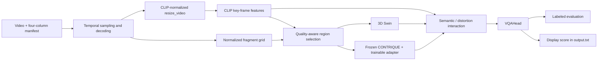

# KSVQE Video Quality Assessment

[中文版](README.md)

I worked on this no-reference video quality assessment project for a course assignment. I wanted to run KSVQE training and evaluation, compare its behavior on KVQ and other video datasets, and examine whether KSVQE and BRISQUE respond similarly to artificial distortions.

I used the [official KVQ / KSVQE code](https://github.com/lixinustc/KVQ-Challenge-CVPR-NTIRE2024), adapted data and configurations, debugged checkpoint loading, and organized training and evaluation results. The KSVQE architecture comes from the original research and implementation. Our team demo also included BRISQUE, distortion controls, and a web interface. This repository preserves records of those features, but not their source code, so it cannot launch the complete web system.

## Method and execution flow

The main call chain is:

```text
train.py / test.py
  → trainer.py::Trainer
  → datasets.ViewDecompositionDataset_KVQ
  → models.model.VQA_Network
  → models.backbones.KSVQE_model.KSVQE
  → models.head.VQAHead
```


The figure comes from the paper and explains the method. For the current execution path, see [KSVQE_model.py](models/backbones/KSVQE_model.py).

KSVQE combines CLIP ViT-B/16 semantic features, quality-aware region selection (QRS), a frozen CONTRIQUE distortion encoder, and 3D Swin spatiotemporal features. Semantic and distortion adapters, attention interactions, and modulation feed a VQAHead that regresses quality scores. My work here uses and adapts that pipeline; these research modules are not my original methods.



One implementation detail matters here: the dataset returns `ori_fragment`, but the current KSVQE forward pass feeds QRS-selected `x_sel_ori.detach()[:, :, ::2, ...]` into CONTRIQUE. It does not read `ori_fragment` directly.

## Videos and annotations

Each manifest row has four comma-separated fields and no header:

```text
relative/video.mp4,cls_label,dis_label,mos
```

Paths are relative to the YAML `data_prefix`. `mos` supplies the subjective quality target, while `dis_label` is used by the distortion contrastive loss. The dataset parses `cls_label`, but the current KSVQE forward pass reads `dis_label`.

The pipeline in [datasets/fusion_datasets.py](datasets/fusion_datasets.py) is:

1. Select indices with `UnifiedFrameSampler`. The main configurations use `clip_len=32`, `num_clips=1` for training and `num_clips=3` for validation, with interval 4 for the challenge setting and 2 for the paper-like setting.
2. Decode the union of requested frames through Decord, avoiding duplicate decoding. An exception triggers the OpenCV fallback. That fallback has no explicit BGR-to-RGB conversion, so the two paths should not be assumed numerically equivalent.
3. Build a resized view and normalize it with CLIP statistics.
4. Assemble a 9 × 9 grid of 32 × 32 spatial fragments into a 288 × 288 view, normalized with ImageNet-style pixel statistics.
5. Return `resize_video`, `fragment`, `ori_fragment`, frame indices, original shape, and labels.

The network receives fragments shaped $B\times3\times T\times288\times288$, where $B$ is batch size and $T$ is the total number of sampled frames. With the main configurations and no `t_frag`, training samples 32 frames and validation samples 96. `num_clips=3` is a sampling setting: KSVQE reads `fragment` and `resize_video` directly, while the generic Trainer's model-key-based clip reshaping does not directly apply to those keys. I therefore do not describe this path as three verified independent forward passes followed by averaging.

### Training splits and seven-class labels

| Setting | challenge / 7class | reference 80/20 / paper7class |
| --- | --- | --- |
| Split | Original challenge directories | Combine original Train / Validation / Test annotations, then split consecutive seven-row groups |
| Training batch size | 4 | 8 |
| Frame interval | 4 | 2 |
| Main configuration | [Kwai_KSVQE.yml](config/Kwai_KSVQE.yml) | [Kwai_KSVQE_paper7class.yml](config/Kwai_KSVQE_paper7class.yml) |

[make_kvq_paper_split.py](scripts/make_kvq_paper_split.py) assumes each consecutive group of seven rows shares reference content. It shuffles groups with seed 42, splits them 80/20, and assigns both label columns values 0–6 by position within a group. The input ordering must satisfy that assumption; the script does not read actual reference IDs or encoding QP metadata.

Earlier notes call these classes “the original video plus six QP bins.” The code only establishes **approximate labels derived from row position**, not verified QP levels. `paper7class` names a paper-like experiment, not an exact reproduction of the paper's protocol. It also does not preserve the original official test split.

The separate [labeltotxt.py](labeltotxt.py) assigns one incrementing group ID to each block of seven rows. That differs from cycling through 0–6 within each group and is not an equivalent seven-class label generator.

## Training and evaluation

Both main configurations specify 50 epochs, 2.5 warmup epochs, AdamW, learning rate `3e-5`, weight decay 0.05, and EMA with a parameter update coefficient of 0.999. The regression head has 768 input channels and 64 hidden channels.

The main training objective is:

$$
L=L_{\mathrm{PLCC}}+0.3L_{\mathrm{distortion\_contrastive}}.
$$

`trainer.py` also computes a configurable rank loss, with weight 0 in both main configurations. Its PLCC loss uses batch-standardized predictions, MOS, and a correlation term; see [trainer.py](trainer.py). It is not plain MSE on raw scores.

Checkpoint loading accepts a plain parameter dictionary or a top-level `state_dict`, strips `module.`, remaps old `technical_backbone` / `technical_head` prefixes to the KSVQE names, and prints missing and unexpected keys. Auxiliary pretrained paths can be overridden through `KSVQE_SWIN_WEIGHTS`, `KSVQE_CONTRIQUE_WEIGHTS`, and `KSVQE_CLIP_WEIGHTS`.

### Labeled metrics versus display scores

`test.py --mode val` requires valid MOS values. After aggregating predictions for each video, it aligns prediction mean and standard deviation to the evaluation labels:

$$
\widetilde{p}_i=\frac{p_i-\mu_p}{\sigma_p}\sigma_y+\mu_y.
$$

It then computes SRCC (also called SROCC), PLCC, KRCC, and RMSE. This alignment uses evaluation labels; it is not a separately fitted calibration model. RMSE should not be compared directly across datasets with different MOS scales.

`test.py --mode test` instead clips and maps raw predictions:

$$
q=1+4\frac{\operatorname{clip}(p,-2.5,2.5)+2.5}{5}.
$$

It writes scores in $[1,5]$ to `output.txt` at the repository root. This is a display heuristic in the code, distinct from the team demo's score scale below and from labeled evaluation.

## Saved results

These values come from [ksvqe_benchmarks.csv](docs/results/ksvqe_benchmarks.csv). The [provenance notes](docs/results/README.md) mark most rows as checked against raw logs when the results were collected. Those logs are not committed here; this README preserves the provenance labels rather than claiming a new evaluation.

| Training setting | Dataset | SRCC | PLCC | KRCC | RMSE |
| --- | --- | ---: | ---: | ---: | ---: |
| challenge / 7class | KVQ | 0.8657 | 0.8679 | 0.6793 | 0.3063 |
| challenge / 7class | LIVE-VQC | 0.5010 | 0.5372 | 0.3509 | 16.4111 |
| challenge / 7class | KoNViD-1k | 0.4667 | 0.4789 | — | — |
| challenge / 7class | YouTube-UGC | 0.6383 | 0.6357 | 0.4525 | 0.5524 |
| reference 80/20 / paper7class | KVQ | 0.8372 | 0.8456 | 0.6471 | 0.3170 |
| reference 80/20 / paper7class | LIVE-VQC | 0.5859 | 0.5988 | 0.4117 | 15.2799 |
| reference 80/20 / paper7class | KoNViD-1k | 0.5432 | 0.5601 | 0.3822 | 0.6011 |
| reference 80/20 / paper7class | YouTube-UGC | 0.7038 | 0.7110 | 0.5099 | 0.4920 |

The challenge / KoNViD-1k row is explicitly sourced from a consolidated report; its provenance note says the raw log stopped at 16/1200 samples. Although an older summary lists KRCC and RMSE, I leave them blank here, following the CSV with the clearer evidence boundary.

I found that paper7class reduced KVQ SRCC from 0.8657 to 0.8372, while LIVE-VQC, KoNViD-1k, and YouTube-UGC changed from 0.5010 / 0.4667 / 0.6383 to 0.5859 / 0.5432 / 0.7038. The split, batch size, and sampling interval changed together. I treat this as a comparison of two settings, not evidence that one isolated change improved transfer.


This is an archived validation plot, not a new training run. The Trainer's historical best tuple tracks each metric's maximum or minimum separately, so its entries need not come from one epoch. Check a checkpoint's actual evaluation output rather than relying only on `model-n` / `model-s` labels or the accumulated best tuple.

## BRISQUE, artificial distortions, and the web demo

In the course team's demo, KSVQE provided deep video quality scores and BRISQUE served as a traditional no-reference image-quality comparison. Existing notes describe per-frame BRISQUE processing and RBF-SVR fitting to video MOS. They also describe video uploads, compression, blur, sharpening, noise, fog, brightness / saturation controls, and side-by-side scores.

**The web frontend and backend, distortion generator, BRISQUE implementation, and raw logs are not committed.** The available material consists of [inference handoff notes](handoff_fullstack_inference/HANDOFF_README.md), the KSVQE inference entry point, and result CSVs. It does not establish web routes, distortion units, display conversion formulas, or individual ownership of those missing components.

### Single-video distortion example

[team_distortion_demo.csv](docs/results/team_distortion_demo.csv) records the following results for one demo video. “Level” is the demo parameter value; its units were not preserved. Both score columns use a higher-is-better display scale. The provenance notes say the native lower-is-better BRISQUE score was reversed for display.

| Condition | Level | KSVQE display score | Change from clean | BRISQUE display score | Change from clean |
| --- | ---: | ---: | ---: | ---: | ---: |
| clean | 0 | 45.7 | 0.0 | 47.6 | 0.0 |
| compression | 10 | 36.9 | -8.8 | 44.1 | -3.5 |
| blur | 12 | 47.9 | +2.2 | 41.2 | -6.4 |
| sharpen | 10 | 45.1 | -0.6 | 45.0 | -2.6 |
| fog | 50 | 46.1 | +0.4 | 43.5 | -4.1 |
| fog | 100 | 52.7 | +7.0 | 30.5 | -17.1 |
| noise | 30 | 41.1 | -4.6 | 42.3 | -5.3 |

One result surprised me: blur and fog increased the KSVQE display score while decreasing the BRISQUE display score. The difference grew between fog levels 50 and 100. Compression and noise lowered both scores.

I have kept this as an observation to investigate. Region selection, the training distortion distribution, and display scaling could all matter, but the missing generator and lack of a controlled multi-video experiment prevent a causal conclusion. The example does not show that fog improves quality or that either method is generally better. There are no exact brightness scores or complete intensity sweeps in the preserved results, so I have not supplied them.

### BRISQUE + SVR records

[brisque_svr_reported.csv](docs/results/brisque_svr_reported.csv) preserves team-reported results for a 117-video LIVE-VQC validation split:

| Setting | SRCC | PLCC |
| --- | ---: | ---: |
| Default sampling + default SVR | 0.5141 | 0.5529 |
| Uniform 32 frames + default SVR | 0.5108 | 0.5476 |
| Uniform 32 frames + GridSearchCV | 0.5110 | 0.4848 |

Uniform sampling and grid search did not consistently improve these results; PLCC was lower in the final setting. I do not treat this table and the KSVQE cross-dataset results as a ranking under identical evaluation splits.

## Running KSVQE

Run commands from the repository root and reuse an existing environment where possible. [requirements.txt](requirements.txt) records a historical Python 3.8 / CUDA 11.8 / RTX 4090 setup; that does not make this GPU model a requirement. The current Trainer explicitly constructs a CUDA device and has no ready-to-use CPU inference mode.

```powershell
python -m pip install -r requirements.txt
python -c "import torch, cv2, decord, timm, einops; print(torch.__version__, torch.cuda.is_available())"
```

Use a PyTorch build compatible with your CUDA environment. The dependency file contains ranges, not an exact environment lock.

### Data and weights

Example local layout:

```text
data/
├── KVQ-dataset/
│   ├── Train/
│   ├── Validation/
│   └── Test/
├── LIVE-VQC/videos/
├── KoNViD-1k/videos/
└── YouTube-UGC/original_videos_h264/
```

Raw videos, actual manifests, and `dataset_csv/` are not in Git. Dataset sources include [KVQ](https://lixinustc.github.io/projects/KVQ/), [LIVE-VQC](https://live.ece.utexas.edu/research/LIVEVQC/), [KoNViD-1k](https://database.mmsp-kn.de/konvid-1k-database.html), and [YouTube-UGC](https://media.withyoutube.com/). See [manifest.example.txt](examples/manifest.example.txt) for the four-column format.

Auxiliary weights include CLIP ViT-B/16, CONTRIQUE, and 3D Swin. Training also uses the LSVQ-pretrained KSVQE weights. The inventory is in [pretrained_weights/README.md](pretrained_weights/README.md). With Git LFS available, fetch the required files:

```powershell
git lfs pull --include="pretrained_weights/clip/ViT-B-16.pt,pretrained_weights/CONTRIQUE_checkpoint25.tar,pretrained_weights/swin_tiny_patch244_window877_kinetics400_1k.pth,pretrained_weights/KSVQE_techniqual_pretrainonLSVQ.pth,handoff_fullstack_inference/final_weights/KSVQE_paper7class_head_val-ltest_s_finetuned.pth"
python check_ksvqe_swin_load.py --mode inspect
```

The committed weight entries are LFS pointers. Running the model requires the actual objects, not just their pointer text.

### Splitting and training

Prepare the source manifests first: `Train/train_data_4col_7class.txt`, `Validation/val_truth_4col_7class.txt`, and `Test/test_MOS_7class.txt`. Video directories alone are insufficient for the split helper. After checking that each consecutive seven-row group shares reference content, generate a paper-like split into a fresh directory:

```powershell
python scripts/make_kvq_paper_split.py --dataset-root data/KVQ-dataset --out-dir dataset_csv/KVQ_paper_split_reproduce --seed 42 --train-ratio 0.8
```

Copy the appropriate training YAML and set `anno_file`, `data_prefix`, and `load_path` for your files. Point the paper-like copy to the newly generated manifests. The commands below assume you have created copies named `config/local_challenge.yml` and `config/local_paper7class.yml`:

```powershell
python train.py --opt config/local_challenge.yml --gpu_id 0 -r checkpoint_challenge_reproduce/
python train.py --opt config/local_paper7class.yml --gpu_id 0 -r checkpoint_paper7class_reproduce/
```

For multiple GPUs, see `train_ddp.py` and the arguments in [train_KSVQE_ddp.sh](scripts/train_KSVQE_ddp.sh).

### Labeled evaluation

Copy the [test configuration](config/Kwai_KSVQE_test.yml) and check videos, MOS, sampling interval, and checkpoint. The committed file currently combines **KVQ Test annotations, interval 4, and paper7class weights**. Running it unchanged should not be equated with either historical protocol in the results table. Check `test_load_path` as well: `test.py` uses it to override `load_path`.

```powershell
python test.py --opt config/local_eval.yml --gpu_id 0 --mode val
```

Cross-dataset templates are available for [LIVE-VQC](config/Kwai_KSVQE_livevqc.yml), [KoNViD-1k](config/Kwai_KSVQE_konvid.yml), and [YouTube-UGC](config/eval_youtube_paper7class.yml). Verify their checkpoint and protocol before use.

### Unlabeled scoring

Keep all four columns, using placeholder labels if needed:

```text
uploads/example.mp4,0,0,0
```

Copy the test YAML to `config/local_inference.yml`, set `anno_file`, `data_prefix`, and `test_load_path`, then run:

```powershell
python test.py --opt config/local_inference.yml --gpu_id 0 --mode test
```

The output is `output.txt` with `video_name,score` rows. A later run overwrites it, so save earlier results separately when needed. This is the repository's inference interface; it does not include a runnable web service.

### Analyzing existing distortion groups

[analyze_kvq_distortions.py](scripts/analyze_kvq_distortions.py) examines metadata and optional frame statistics for existing KVQ seven-video groups, then applies standardization, PCA, and K-means. It does not generate blur, fog, or noise. To include frame statistics:

```powershell
python scripts/analyze_kvq_distortions.py --train-root data/KVQ-dataset/Train --val-root data/KVQ-dataset/Validation --test-root data/KVQ-dataset/Test --with-frame-features --out-dir analysis/kvq_reproduce
```

Matching annotations are required, and metadata extraction calls `ffprobe`. Brightness, contrast, sharpness, and other frame statistics support exploration; they are not ground-truth processing-pattern labels.

## Repository layout

```text
.
├── config/                    # Training, evaluation, and cross-dataset configurations
├── datasets/                  # Decoding, sampling, and view decomposition
├── models/                    # KSVQE, CLIP, CONTRIQUE, Swin, and regression heads
├── docs/results/              # Metric CSVs and provenance
├── figs/                      # Paper figures and archived experiment plots
├── pretrained_weights/        # Auxiliary pretrained weight pointers
├── handoff_fullstack_inference/ # Handoff notes and final weight pointer
├── scripts/                   # Split, inspection, analysis, and launch helpers
├── train.py / train_ddp.py
├── test.py / trainer.py
├── KSVQE_RUNBOOK.md            # Existing runbook
├── KSVQE实验指标汇总.md         # Historical summary; check claims against code
├── PROJECT_SUMMARY.md          # Earlier project notes
├── requirements.txt
├── README.md
└── README_EN.md
```

I have kept the inconsistencies and implementation limits visible for future work. This documentation update did not retrain models, recompute full test-set metrics, or draw new conclusions from the missing web and BRISQUE implementations.

## Sources and attribution

KSVQE / KVQ research and core implementation belong to their original authors. The repository also uses CLIP, CONTRIQUE, Swin, and components associated with the upstream SimpleVQA and DOVER acknowledgments. Code and weights remain subject to their respective source terms; this repository does not establish complete third-party redistribution permission.

```bibtex
@inproceedings{lu2024kvq,
  title={KVQ: Kwai Video Quality Assessment for Short-form Videos},
  author={Lu, Yiting and Li, Xin and Pei, Yajing and Yuan, Kun and Xie, Qizhi and Qu, Yunpeng and Sun, Ming and Zhou, Chao and Chen, Zhibo},
  booktitle={Proceedings of the IEEE/CVF Conference on Computer Vision and Pattern Recognition},
  year={2024}
}

@inproceedings{li2024ntire,
  title={NTIRE 2024 Challenge on Short-form UGC Video Quality Assessment: Methods and Results},
  author={Li, Xin and Yuan, Kun and Pei, Yajing and Lu, Yiting and Sun, Ming and Zhou, Chao and Chen, Zhibo and Timofte, Radu and others},
  booktitle={Proceedings of the IEEE/CVF Conference on Computer Vision and Pattern Recognition Workshops},
  year={2024}
}
```

Upstream acknowledgments: [KVQ/KSVQE](https://github.com/lixinustc/KVQ-Challenge-CVPR-NTIRE2024), [SimpleVQA](https://github.com/sunwei925/SimpleVQA) and [DOVER](https://github.com/VQAssessment/DOVER).
